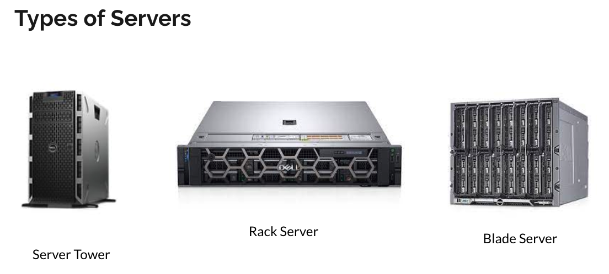
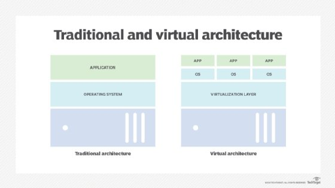
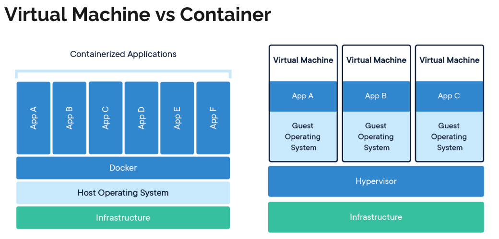
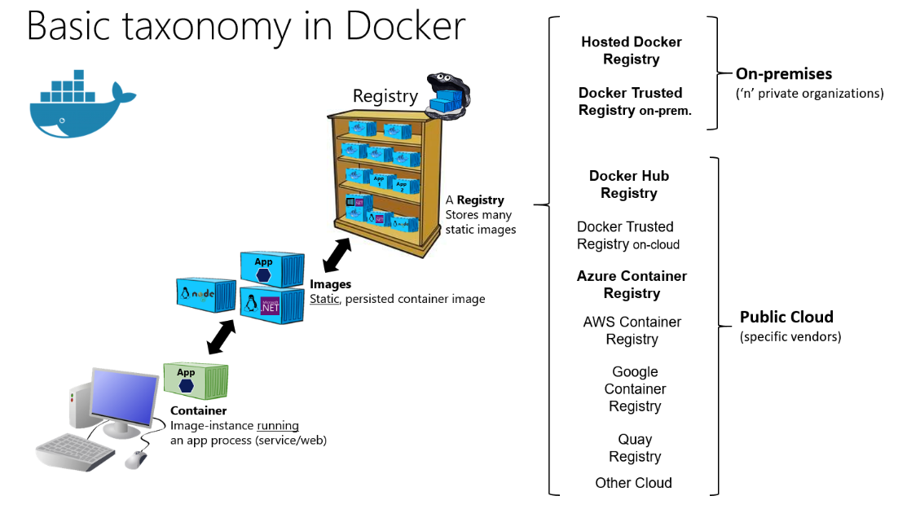

# Coaching | SCTP in SE | Module 4 | DevOps Week 2

<details>
<summary><b>1. Docker Commands Quiz</b></summary>

Test your Docker command knowledge with the following quiz.

### Q1: Which command is used to build a Docker image?
- **A:** `docker build` (Correct)
- **B:** `docker ps`
- **C:** `docker ls`
- **D:** `docker image ls`

### Q2: What could cause a `docker build` command to fail?
- **A:** Incorrect directory
- **B:** Docker not installed (Correct)
- **C:** Missing Dockerfile in the directory (Correct)
- **D:** Docker Compose not installed

### Q3: Which command runs an image as a container?
- **A:** `docker build`
- **B:** `docker run` (Correct)
- **C:** `docker ps`
- **D:** `docker launch`

### Q4: How can you list containers that are currently running?
- **A:** `docker build`
- **B:** `docker ps` (Correct)
- **C:** `docker ls`
- **D:** `docker launch`

### Q5: Docker is exclusively used for production environments and is not suitable for development.
- **A:** True
- **B:** False (Correct)

</details>

<details>
<summary><b>2. Servers & Virtualization Explained</b></summary>

### Servers

In the early days of computing, applications were hosted on bare-metal servers. These servers are the physical hardware that underpins much of our digital world. A bare-metal server typically runs a single operating system and is dedicated to a single tenant or application. This approach ensured maximum performance for the application but was not without its drawbacks. Each server needed to be individually maintained and managed, leading to increased operational complexity and costs. Additionally, this one-to-one relationship between servers and applications meant that resources could be underutilized, as a server might not always be operating at full capacity.

### Virtualization

Virtualization technology was a game-changer for IT infrastructure. By introducing a layer called a hypervisor above the physical hardware, it became possible to divide a single physical server into multiple isolated virtual machines (VMs). Each VM acts like a separate server, capable of running its own operating system and applications. This innovation dramatically increased the efficiency of resource utilization.

The benefits of virtualization include:

1. Resource Optimization: By consolidating multiple VMs on a single server, organizations can significantly reduce their hardware requirements.
2. Cost Reduction: Fewer physical servers mean lower hardware and energy costs.
Improved Flexibility and Scalability: Virtual machines can be quickly provisioned, copied, and moved, allowing for agile development and testing environments.
Enhanced Disaster Recovery: Virtualization simplifies backup and disaster recovery processes, as virtual machines can be easily replicated and restored.

### Virtualization vs Containers

While virtualization was a significant advancement, the technology's evolution didn't stop there. Containers emerged as a lighter, more efficient alternative to VMs, especially suited for microservices and cloud-native applications. Unlike VMs, which virtualize the entire operating system, containers virtualize at the application level, sharing the host OS kernel. This means containers are more lightweight and start much faster than VMs.

Key distinctions include:

1. Isolation Level: Containers provide process-level isolation, while VMs offer full isolation of virtualized hardware for each instance.
2. Performance: Containers have less overhead, leading to better performance and more efficient resource use compared to VMs.
3. Portability: Containers include all necessary application code and dependencies, making them highly portable across different computing environments.
4. Use Cases: VMs are still preferred for applications requiring full isolation, extensive resources, or specific OS environments. Containers are ideal for microservices, dev/test scenarios, and applications where density and efficiency are critical.

### An Analogy

Imagine you're planning to open several restaurants, each offering a different cuisine. Think of each restaurant as an application, and the building where it's housed as the server hardware.

1. Virtualization: Apartment Complexes
Virtualization can be compared to building an apartment complex on your plot of land. Each apartment in the complex is like a virtual machine (VM) - a separate, self-contained unit that shares the overall structure's physical resources (the land and building) but has its own utilities and facilities (like water, electricity, and gas). Each apartment (VM) can be customized to the needs of its occupants (different operating systems and applications), but they all share the underlying infrastructure. This setup allows for efficient use of space (hardware resources), but each apartment still maintains a level of isolation and independence, with its own secured entrances and facilities.

2. Containers: Food Trucks in a Park
On the other hand, using containers is like setting up food trucks in a public park. The park is the server's operating system, and each food truck is a container. All the food trucks use the park's existing facilities - like water, electricity, and seating areas - but each offers a unique menu (application). Food trucks are quicker and cheaper to set up than building an entire apartment complex. They can move around or make menu changes (application updates) with much more flexibility. However, they rely on the park's existing infrastructure and cannot operate without it, similar to how containers share the host operating system.

So:
1. Virtualization (Apartment Complexes): Offers more isolation and independence at the cost of being more resource-intensive to set up and maintain. Each apartment is like a full-fledged server that can run its own operating system.
2. Containers (Food Trucks): More resource-efficient, sharing the underlying infrastructure of the park (operating system) but less isolated. They're quicker to set up and more flexible in deployment, ideal for services that need to scale up or down rapidly.

</details>

<details>
<summary><b>3. Demystifying Docker</b></summary>

### Dockerfile
Think of a Dockerfile as the blueprint for your application's container. It contains a set of instructions that Docker uses to build the container's environment. Each instruction in a Dockerfile adds a layer to the image, with each layer representing a part of the application. For example, one layer might contain your application code, another the libraries it depends on, and another the runtime environment it needs to run.

The Dockerfile starts with specifying a base image using the `FROM` instruction. This base image is the foundation of your container and can be an operating system like Ubuntu or a pre-made image like `Node.js` or Python. From there, you can use instructions like `COPY` to add files from your local file system to the image, `RUN` to execute commands to install software, and `CMD` or `ENTRYPOINT` to specify what command runs when the container starts.

### Docker Image
A Docker image is an immutable artifact that contains everything needed to run your application. This includes the application code, runtime, libraries, environment variables, and configuration files. Images are built from the instructions in a Dockerfile and then stored in a Docker registry.

Because images are immutable, if you need to make changes to your application, you create a new image. This ensures consistency and reliability, as each image is a snapshot of the application at a specific point in time. Images can be shared and reused, making it easy to deploy your application across different environments.

### Docker Container
A Docker container is a running instance of a Docker image. When you start a container, Docker takes the image and creates a writable layer on top of the immutable layers of the image. This writable layer allows the application to write to the filesystem, maintaining the changes as long as the container is running.

Containers are isolated from each other and the host system, with their own filesystem, networking, and isolated process space. This isolation ensures that applications do not interfere with each other and can run simultaneously on the same host machine. Containers are lightweight and start quickly, making them ideal for environments where scalability and efficiency are critical.

### Image Registry

An image registry is a centralized place where Docker images can be stored, shared, and managed. The most well-known registry is Docker Hub, which hosts a vast number of public images that anyone can use. In addition to Docker Hub, there are private registries like Amazon Elastic Container Registry (ECR) and Azure Container Registry (ACR), which organizations use to store and manage proprietary images securely.

Registries play a crucial role in the Docker ecosystem, facilitating the distribution and version control of images. They allow developers to push images to the registry and pull them down to any environment for deployment, making it easy to share images across teams and deploy applications consistently.
</details>

<details>
<summary><b>4. Mastering Docker Compose</b></summary>



Learn how Docker Compose orchestrates multi-container applications, simplifying deployment and scaling with YAML configuration files. Explore an example `docker-compose.yml` file [here](https://github.com/edisonzsq/sample-docker-compose/blob/main/docker-compose.yml).

</details>

<details>
<summary><b>5. Practical Challenge: Containerize a Java Application</b></summary>

Containerize your Module 3 Java application for a hands-on Docker Compose experience.

### Challenge Repository
Explore and utilize this [Spring Boot demo](https://github.com/edisonzsq/spring-boot-demo) repository.

### Commands to Begin

```
git clone https://github.com/edisonzsq/spring-boot-demo
cd spring-boot-demo
git checkout docker_compose_with_postgres
docker compose up
```

Refer to the `README.md` for API endpoint testing instructions.

</details>
