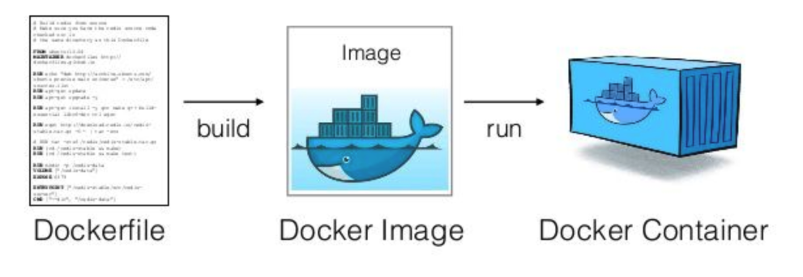

# Coaching | SCTP in SE | Module 4 | DevOps Week 2

<details>
<summary>1. Docker Commands Quizzes</summary>

## Q1 - Which commands build an image?

A: docker build

B: docker ps

C: docker ls

D: docker image ls

## Q2 - What could be the reason(s) when `docker build` returns an error?

A: You are on a wrong directory

B: You did not install docker

C: There is no dockerfile in the same directory

D: You did not install docker compose

## Q3 - Which command launch image as a container instance?

A: docker build

B: docker run

C: docker ps

D: docker launch

## Q4 - How can I view containers that are currently running?

A: docker build

B: docker ps

C: docker ls

D: Use docker desktop

## Q5 - Docker is used for production and not for development

A: True

B: False

</details>

<details>
<summary>2. Understanding Servers & Virtualization</summary>

## Servers


Applications started being hosted in bare metal servers. One server contains one operating systems.

## Virtualization


- Virtualization is a technology that allows for the creation of virtual instances of physical resources.
- By using a hypervisor or virtualization software, it divides the physical resources into multiple isolated virtual environments
- This approach maximizes resource utilization, enhances flexibility in resource management, and can significantly reduce costs by minimizing the need for physical hardware.

## Virtualization vs Container


- Virtualization divides a single physical server into multiple, isolated virtual machines (VMs).
- Containers, on the other hand, share the same operating system kernel and isolate the application processes from each other, making them lighter and more efficient than VMs. 
- While virtualization provides broad compatibility and strong isolation at the cost of higher resource consumption, containers offer rapid deployment, less overhead, and more efficient use of system resources, ideal for microservices and cloud-native applications.

</details>

<details>
<summary>3. How Docker Works</summary>



- **Dockerfile**
  - A Dockerfile is a text file that contains a list of commands Docker uses to build an image. It specifies the base image to use, the files to copy into the image, the commands to run, and other configurations.
  - Developers write Dockerfiles to define the environment of the container, including installing software, setting environment variables, and configuring settings.
  - The Docker build process takes the Dockerfile as input and executes the instructions line by line to create a Docker image.

- **Docker Image**
  - A Docker image is a lightweight, standalone, executable package that includes everything needed to run a piece of software, including the code, runtime, libraries, environment variables, and config files.
  - Images are built from Dockerfiles and are stored in a Docker registry, such as Docker Hub, from where they can be downloaded and used to create containers.
  - Docker images are immutable, meaning once they are created, they do not change. If you need to make changes, you create a new image with the desired changes.

- **Docker Container**
  - A Docker container is a runtime instance of a Docker image. When you run an image, Docker creates a container from that image.
  - Containers run the actual applications, keeping them isolated from the host system and from each other. Each container has its own filesystem, networking, and isolated process space.
  - Containers can be started, stopped, moved, and deleted independently. They are lightweight because they share the host system’s kernel and do not require an OS per application.

## Image Registry


An image registry is a centralized, online repository where Docker images can be stored, shared, and managed. It allows developers to push images to the registry and pull images from the registry to their local system or to a production environment, facilitating easy distribution and version control of containerized applications. 

Popular examples include Docker Hub, which is the default public registry for Docker images, and private registries like Amazon Elastic Container Registry (ECR) and Azure Container Registry (ACR), which offer controlled access for storing proprietary images.

</details>

<details>
<summary>4. Docker Compose</summary>


Docker Compose is a tool for defining and running multi-container Docker applications. With a single command, you can use a YAML file to configure all of your application’s services, networks, and volumes, and then create and start all the services from your configuration. It simplifies the deployment and scaling of applications by allowing you to manage the entire lifecycle of your application with simple commands, making it easier to build, test, and deploy multi-container applications.

How `docker-compose.yml` file looks like: https://github.com/edisonzsq/sample-docker-compose/blob/main/docker-compose.yml
</details>

<details>
<summary>5. Challenge</summary>

## Challenge - Containerize your Module 3 Java Application

Reference this repository: https://github.com/edisonzsq/spring-boot-demo

Commands to try the repository:

```
git clone https://github.com/edisonzsq/spring-boot-demo
cd spring-boot-demo
git checkout docker_compose_with_postgres
docker compose up
```

See the `readme.md` file in the repository for instruction to test the API Endpoint.

</details>
